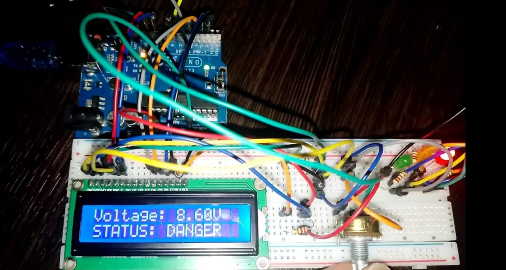

## Dennis Kyule Muli

Electrical Engineer| Electronics | Arduino & ESP32 Developer | IoT Systems Developer

## About Me

I am an Electrical Engineer passionate about embedded systems, battery management systems, IoT solutions, and smart agricultural technologies.

I have experience developing Arduino and ESP32-based projects involving sensor integration, wireless communication, and real-time monitoring systems.

## Projects

**1. Battery Management System (BMS)**

- Voltage monitoring
- Current monitoring
- Temperature monitoring
- Bluetooth communication
- Battery protection logic
  

**2. Portable Laboratory**

- ESP32 based system
- RS485 communication
- Multi-parameter sensing
- Real-time monitoring
 

**3. Fire Detection System**

- Smoke sensor
- Flame sensor
- Temperature sensor
- Automated warning and suppression logic
 

## Technical Skills

**1. Programming**
- Arduino C++
- ESP32
- Embedded Systems

**2. Electronics**
- Sensor Integration
- Circuit Design
- Battery Monitoring Systems
- RS485 Communication

## Tools
- GitHub
- Wokwi
- Arduino IDE

## Experience

- Kenya Power and Lighting Company (KPLC)
- Kenya Bureau of Standards (KEBS)
- Head of IAE Bornelabs

## Contact

- Email: dennismuli@gmail.com
- GitHub: github.com/Mude-Dennis
