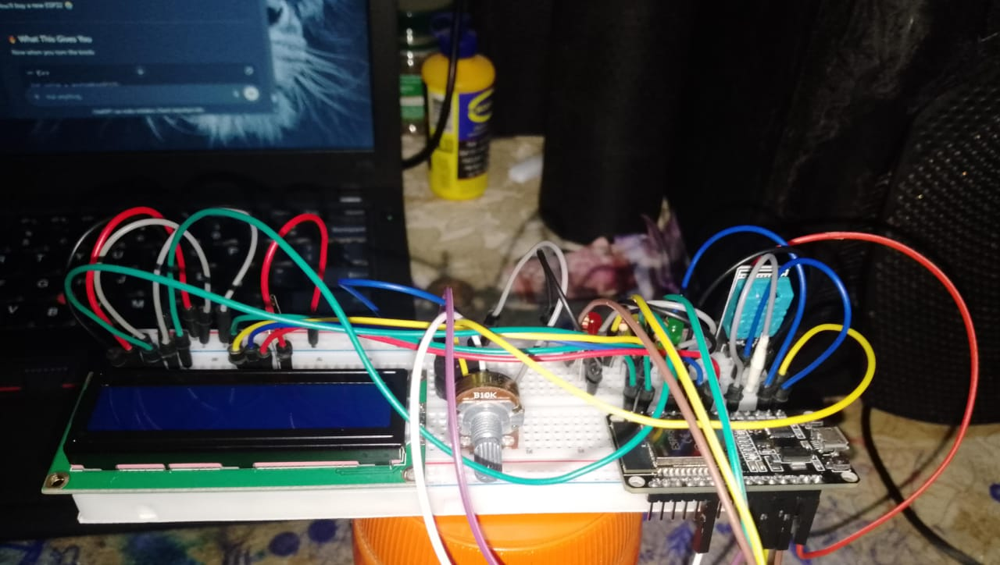
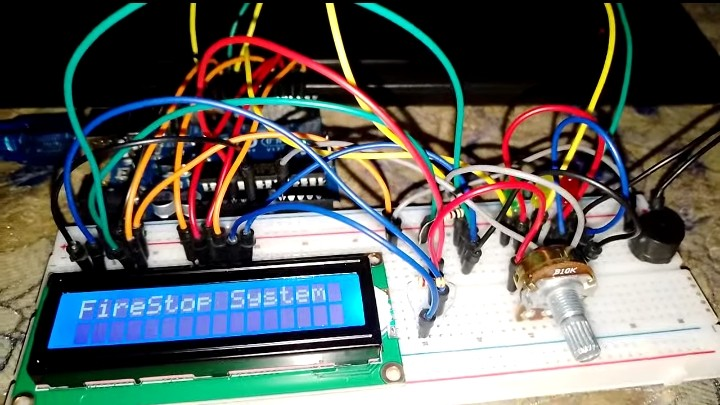

# Dennis Kyule Muli

**Electrical Engineer | Electronics Engineer | Arduino & ESP32 Developer | IoT Systems Developer**

---

## About Me

I am an Electrical Engineer passionate about embedded systems, battery management systems (BMS), Internet of Things (IoT) solutions, and smart agricultural technologies. I specialize in designing intelligent electronic systems that integrate hardware and software to solve real-world engineering challenges.

My experience includes developing Arduino and ESP32-based solutions featuring sensor integration, wireless communication, industrial communication protocols, automation, and real-time monitoring. I enjoy building innovative systems that improve efficiency, safety, and sustainability.

---

## Technical Skills

| Category | Skills |
|----------|--------|
| **Programming** | Arduino C++, ESP32, Embedded Systems |
| **Electronics** | Circuit Design, Sensor Integration, Battery Management Systems, RS485 Communication |
| **IoT** | Wireless Communication, Real-Time Monitoring, Data Acquisition |
| **Development Tools** | Arduino IDE, GitHub, Wokwi |

---

## Featured Projects

### Battery Management System (BMS)

An intelligent Battery Management System designed to monitor battery health, enhance safety, and improve battery performance through real-time monitoring and protection mechanisms.

**Key Features**

- Voltage Monitoring
- Current Monitoring
- Temperature Monitoring
- Bluetooth Communication
- Battery Protection Logic

  

---

### Portable Laboratory System

An ESP32-powered portable laboratory platform capable of collecting and transmitting multiple environmental and electrical parameters for real-time monitoring applications.

**Key Features**

- ESP32-Based Architecture
- RS485 Communication
- Multi-Parameter Sensing
- Real-Time Monitoring

  

---

### Fire Detection System

A smart fire detection system designed for early hazard detection using multiple sensors and automated response logic to improve safety.

**Key Features**

- Smoke Detection
- Flame Detection
- Temperature Monitoring
- Automated Warning System
- Suppression Logic

  

---

## Professional Experience

| Organization | Position / Experience |
|--------------|----------------------|
| Kenya Power and Lighting Company (KPLC) | Electrical Engineering Experience |
| Kenya Bureau of Standards (KEBS) | Engineering & Standards Experience |
| IAE Bornelabs | Head of IAE Bornelabs |

---

## Tools & Technologies

  

---

## Currently Exploring

- Advanced Embedded Systems
- Internet of Things (IoT)
- Smart Agriculture Solutions
- Battery Energy Storage Systems
- Industrial Automation
- Wireless Sensor Networks

---

## Connect With Me

- **Email:** dennismuli@gmail.com
- **GitHub:** https://github.com/Mude-Dennis

---

Building intelligent embedded systems that bridge electronics, automation, and IoT.

